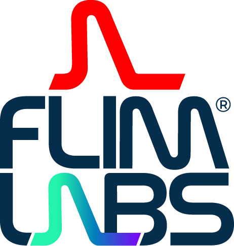

<!-- PROJECT LOGO -->

  <h1>FLIM LABS Data Acquisition Card Drivers</h1>

  

 

<!-- TABLE OF CONTENTS -->

  
Table of Contents

  <ol>
    <li>
      <a href="#download-drivers">Download Drivers</a>
    </li>
    <li><a href="#useful-links">Useful Links</a></li>
     <li><a href="#contact">Contact</a></li>
  </ol>

<!-- Dowload Drivers -->

## Download Drivers [(click here)](https://github.com/flim-labs/flim-labs-drivers/releases/tag/data-acquisition-card-drivers) 

Welcome to [FLIM LABS Data Acquisition Card Drivers](https://github.com/flim-labs/flim-labs-drivers) page. In this page you can download the installer for the FLIM LABS Data Acquisition Card Drivers.

Data Acquisition Card Drivers must necessarily be installed on your PC if you want to run locally one of the following projects:

<ul style="">
    <li>
     
    <a target="_blank" href="https://github.com/flim-labs/intensity-tracing-py">FLIM LABS - Intensity Tracing</a>
    </li>
       <li>
     
    <a target="_blank" href="https://github.com/flim-labs/spectroscopy-py">FLIM LABS - Spectroscopy</a>
    </li>
</ul>

If, however, you decide to install [Intensity Tracing](https://github.com/flim-labs/intensity-tracing-py/releases/tag/v1.4) and [Spectroscopy directly](https://github.com/flim-labs/spectroscopy-py/releases/tag/v1.0) on your PC, you will not also need to download the drivers, because their installation will be integrated during the application installation

 

<a target="_blank" href="https://github.com/flim-labs/flim-labs-drivers/releases/tag/data-acquisition-card-drivers" download>

 DOWNLOAD DRIVERS</a>

(<a href="#readme-top">back to top</a>)

<!-- USEFUL LINKS -->

## Useful Links

- [FLIM LABS Data Acquisition Card](https://www.flimlabs.com/products/data-acquisition-card/)
- [FLIM LABS - Intensity Tracing](https://github.com/flim-labs/intensity-tracing-py)
- [FLIM LABS - Intensity Tracing](https://github.com/flim-labs/spectroscopy-py)

(<a href="#readme-top">back to top</a>)

<!-- CONTACT -->

## Contact

FLIM LABS: info@flimlabs.com

Project Link: [FLIM LABS Drivers](https://github.com/flim-labs/flim-labs-drivers)

(<a href="#readme-top">back to top</a>)

